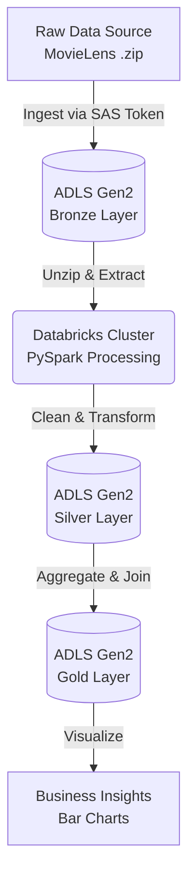

# 🎬 End-to-End Azure Data Engineering Pipeline: MovieLens Analysis


## 📊 Project Overview
This project implements a scalable data engineering pipeline on **Microsoft Azure** to analyze the MovieLens dataset. The goal was to build a secure, cloud-native solution that ingests raw data, transforms it using **PySpark** on **Databricks**, and derives actionable insights about movie popularity and user ratings.

**Key Outcome:** Analyzed 100,000+ ratings to identify the highest-rated movies of all time, visualizing the results for business stakeholders.

## 🛠️ Prerequisites
Before running this pipeline, ensure you have the following:

* **Azure Subscription** (Free Tier or Pay-As-You-Go)
* **Azure Databricks Workspace** (Standard Tier or higher)
* **Azure Data Lake Storage Gen2 (ADLS)** account
* **MovieLens Dataset:** The raw `.zip` file from GroupLens (details below).

### 📂 Data Source
This project uses the **MovieLens** dataset provided by GroupLens Research.
* **Source:** [MovieLens Datasets](https://grouplens.org/datasets/movielens/)
* **Format:** We ingest the raw compressed file (e.g., `ml-latest-small.zip`) directly to demonstrate handling zipped data in the Bronze layer.

## 🖼️ Analysis Result
*Output from the Gold Layer visualization:*


---

## 🏗️ Architecture & Workflow
The pipeline follows the **Medallion Architecture** (Bronze → Silver → Gold) to ensure data quality and organization.




### 1️⃣ Bronze Layer (Ingestion & Extraction)
* **Security:** Configured **SAS Token (Shared Access Signature)** for secure, temporary access to Azure Data Lake Gen2 (ADLS), replacing the deprecated "Mounting" method.
* **Ingestion:** Ingested compressed raw data (`.zip`) from Azure Storage.
* **Extraction:** Implemented a shell-based logic to unzip files on the Databricks driver and re-upload extracted CSVs to the Data Lake.

**Technical Highlight:** Solving the zipped file ingestion challenge:
```python
# Moving file to local driver, unzipping via shell, and moving back to DBFS
import subprocess

# Copy from ADLS to local driver
dbutils.fs.cp(zip_source_path, "file:/tmp/data.zip")

# Unzip using shell command
subprocess.run(["unzip", "-o", "/tmp/data.zip", "-d", "/tmp/extracted"])

# Move CSVs back to ADLS Bronze layer
dbutils.fs.cp("file:/tmp/extracted/movies.csv", bronze_output_path)
```ls.fs.cp("file:/tmp/extracted/movies.csv", bronze_output_path)
```

### 2️⃣ Silver Layer (Transformation)
* **Schema Enforcement:** Loaded raw CSVs into Spark DataFrames with defined schemas.
* **Data Cleaning:** Converted Unix timestamps into human-readable `Date` formats using PySpark functions.
* **Handling:** Processed "Movies" and "Ratings" tables independently.

### 3️⃣ Gold Layer (Aggregation & Business Logic)
* **Join Logic:** Merged the Movies and Ratings datasets on `movieId`.
* **Aggregation:** Calculated the **Average Rating** and **Total Vote Count** per movie.
* **Filtering:** Applied a threshold (>50 votes) to filter out statistical outliers and focus on statistically significant data.

---

## 🛠️ Tech Stack
* **Cloud Platform:** Microsoft Azure
* **Storage:** Azure Data Lake Storage Gen2 (ADLS)
* **Compute:** Azure Databricks (Spark Cluster)
* **Language:** Python (PySpark)
* **Security:** SAS Tokens (Direct Access)

## 🚀 Key Learnings & Challenges
* **Security First:** Moving away from `dbutils.fs.mount()` to Direct Access via SAS Tokens to adhere to modern security best practices.
* **Handling Zipped Data:** Solved the limitation of Spark not reading zipped files natively in object storage by implementing a local-driver extraction pattern.
* **Optimization:** Used Spark's lazy evaluation and optimized transformations (narrow vs. wide) for efficient processing.

## 📈 Future Scope
* **Automation:** Orchestrate the notebook using **Azure Data Factory (ADF)** for daily runs.
* **Delta Lake:** Convert file formats to **Delta** tables to enable ACID transactions and "Time Travel."
* **Sentiment Analysis:** Use NLP to analyze user tags and reviews for deeper insights.

---
*Author: Sugam Dewan*
